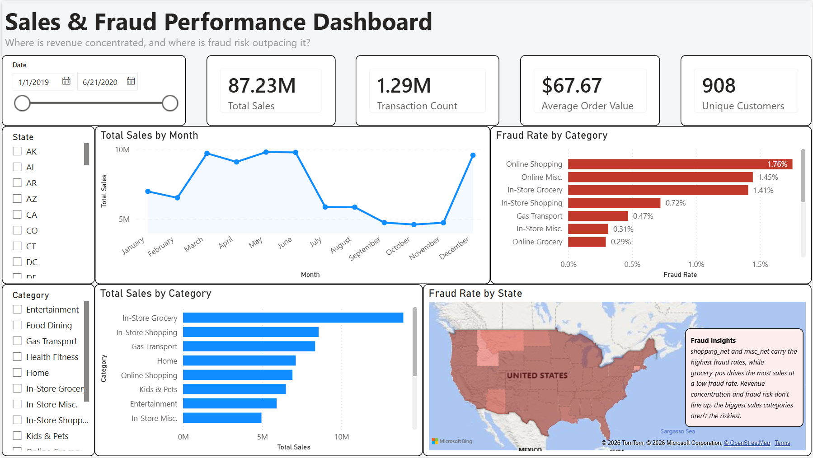

# Sales Performance & Fraud Risk Dashboard

**Where does revenue concentrate, and where is fraud risk outpacing it?**

An interactive Power BI dashboard built on 1.3 million credit card transactions. The analysis sets total sales against fraud exposure and shows that the two do not line up. The categories and channels that bring in the most revenue are not the ones carrying the most fraud risk.

## The headline finding

Fraud was **0.58% of transactions but 4.37% of dollars**. By count it looks like a rounding error. Weighted by money, it is the real exposure. The average fraudulent charge was about **$531** against **$68** for a legitimate one, so a single fraud event costs far more than its frequency suggests.

## What the data showed

- **Grocery is the revenue leader and a fraud hotspot.** It topped every category in sales while carrying an unusually high in-person fraud rate, so the highest-volume category is also one of the riskiest.
- **Online over-indexes on fraud.** Online channels pulled fraud well above their share of revenue, the reverse of the grocery pattern.
- **Revenue and risk rank differently.** Sorting categories by sales produces a different order than sorting them by fraud exposure, and that gap is the tension the dashboard is built to surface.

## How it was built

**SQL (DB Browser for SQLite).** Cleaned and aggregated the raw 1.3M-row dataset. Built a clean working table with `CREATE TABLE AS SELECT`, confirmed row counts, then ran aggregations for sales by month, by category, and by state, plus headline totals, customer acquisition, and two fraud queries.

**Power Query.** Removed the index column, added a date-only column while keeping the original timestamp intact, and retyped the card number as text so Power BI would not read it as a number.

**Power BI and DAX.** Five measures drive the visuals: Total Sales, Transaction Count, Average Order Value, Unique Customers, and Fraud Rate. The fraud rate uses `CALCULATE` to isolate fraudulent transactions.

## What's on the dashboard

- KPI cards for the headline numbers across the top
- A monthly sales trend line
- Fraud rate by category, sorted, with percentage labels
- A choropleth map of activity by state
- A fraud-insight callout summarizing the dollar-volume finding
- Three slicers for interactive filtering

## Repository contents

- `transactions_analysis.sql`: SQL scripts for cleaning and aggregation
- `dashboard.pbix`: the Power BI file
- `dashboard.png`: screenshot of the final dashboard

## Data source

Credit card transactions dataset from Kaggle, licensed under Apache 2.0. The raw dataset is not committed here because of its size and license. The SQL, the Power BI file, and the screenshot are included so the analysis can be reproduced from the original source.
